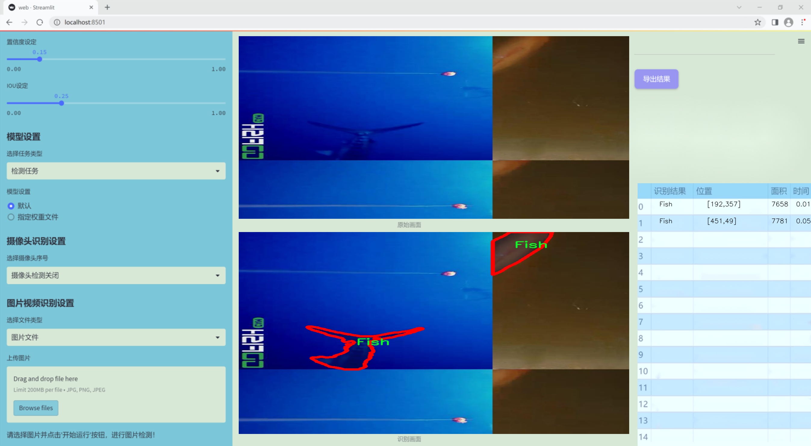
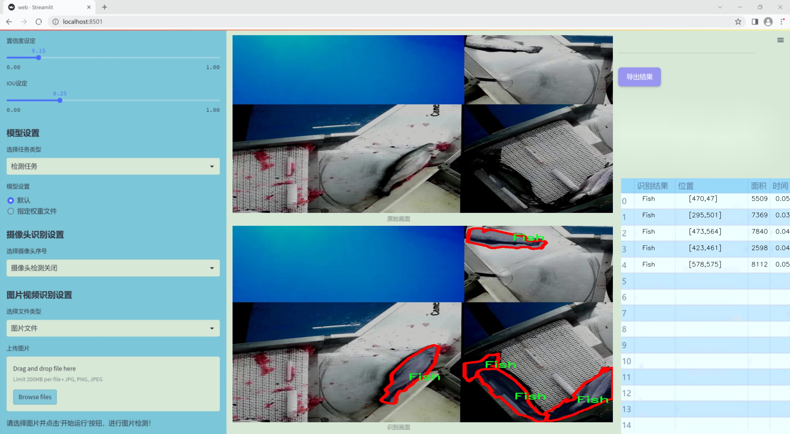
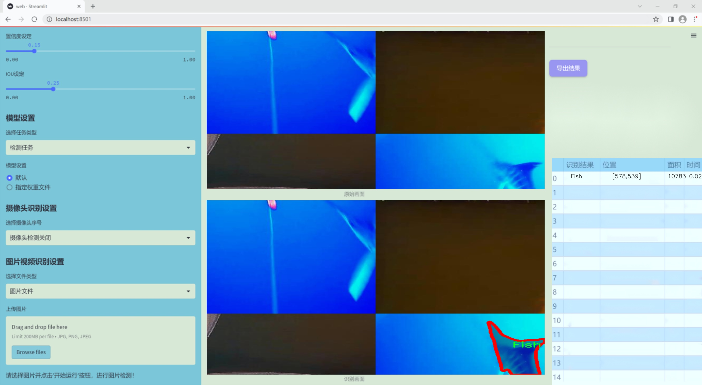
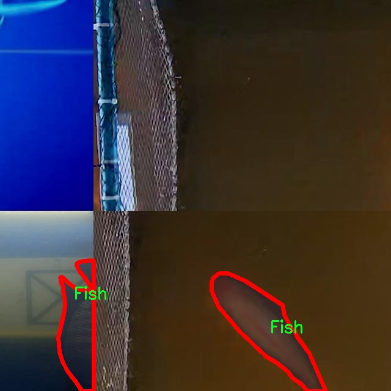
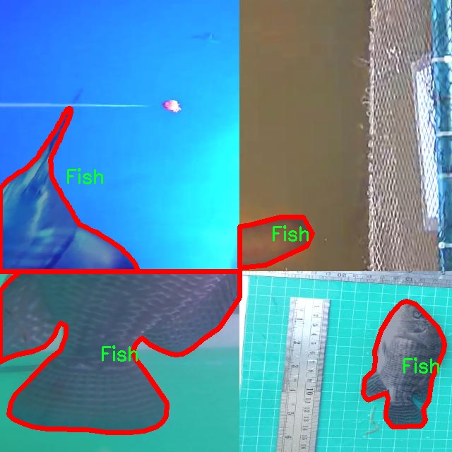
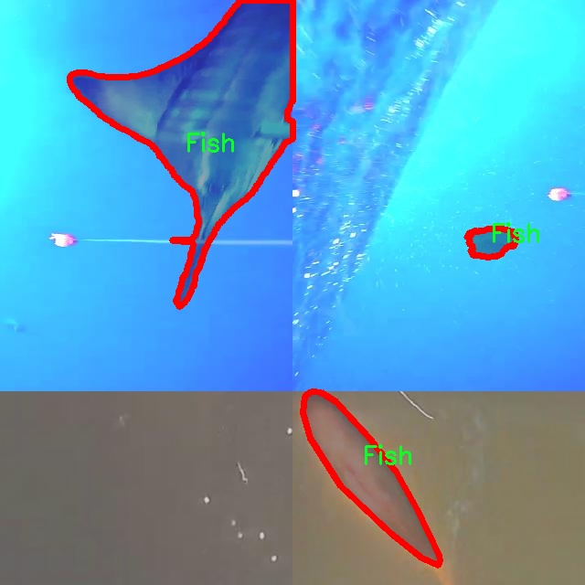
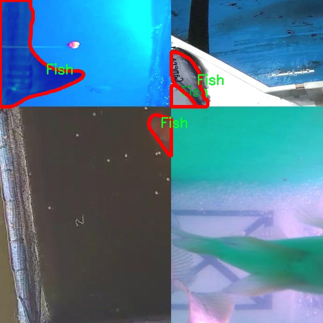
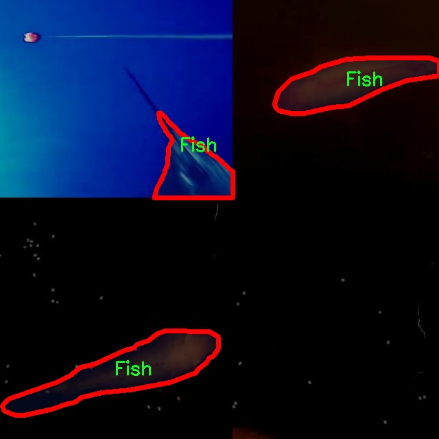

### 1.背景意义

研究背景与意义

随着全球水产养殖业的快速发展，鱼类的种类和数量日益丰富，如何有效地进行鱼类的监测与管理成为了一个亟待解决的问题。传统的鱼类识别方法往往依赖于人工观察，不仅耗时耗力，而且容易受到人为因素的影响，导致识别准确率低下。因此，基于计算机视觉的自动化鱼类检测技术应运而生，成为提高水产养殖管理效率的重要手段。

在众多计算机视觉技术中，YOLO（You Only Look Once）系列模型因其高效的实时检测能力而备受关注。YOLOv11作为该系列的最新版本，具备更强的特征提取能力和更快的推理速度，适合用于复杂环境下的鱼类实例分割任务。通过对YOLOv11模型的改进，结合鱼类实例分割的特定需求，可以实现对不同鱼类的精准识别与分割，为水产养殖的智能化管理提供技术支持。

本研究所使用的数据集包含5100张经过精心标注的鱼类图像，涵盖了多种鱼类的实例。这些数据不仅为模型的训练提供了丰富的样本，还为后续的模型评估和优化奠定了基础。通过对数据集的深入分析与处理，能够有效提升模型的识别准确率，进而推动鱼类监测技术的进步。

此外，鱼类实例分割检测系统的研究不仅具有重要的学术价值，也对实际应用具有深远的影响。通过实现高效、准确的鱼类检测，可以为水产养殖的可持续发展提供数据支持，帮助渔业管理者做出更科学的决策，促进资源的合理利用。因此，基于改进YOLOv11的鱼类实例分割检测系统的研究，不仅是对计算机视觉技术的探索，也是对水产养殖行业未来发展的积极推动。

### 2.视频效果

[2.1 视频效果](https://www.bilibili.com/video/BV1HLrZYVETU/)

### 3.图片效果







##### [项目涉及的源码数据来源链接](https://kdocs.cn/l/cszuIiCKVNis)**

注意：本项目提供训练的数据集和训练教程,由于版本持续更新,暂不提供权重文件（best.pt）,请按照6.训练教程进行训练后实现上图演示的效果。

### 4.数据集信息

##### 4.1 本项目数据集类别数＆类别名

nc: 1
names: ['Fish']


该项目为【图像分割】数据集，请在【训练教程和Web端加载模型教程（第三步）】这一步的时候按照【图像分割】部分的教程来训练

##### 4.2 本项目数据集信息介绍

本项目数据集信息介绍

本项目旨在改进YOLOv11的鱼类实例分割检测系统，所使用的数据集为“merged_data_sets”。该数据集专注于鱼类的检测与分割，具有重要的生态和商业价值。数据集中包含的类别数量为1，具体类别为“Fish”。这一单一类别的设定使得模型能够更加专注于鱼类的特征提取与实例分割，从而提高检测的准确性和效率。

数据集的构建过程经过精心设计，确保涵盖了多种鱼类的不同姿态、大小和环境背景。这种多样性不仅提高了模型的泛化能力，也使其在实际应用中能够更好地适应不同的场景和条件。数据集中包含的图像均经过标注，确保每一条鱼类实例都被准确地框定和分割。这一标注过程采用了先进的图像处理技术，确保了数据的高质量和高可靠性。

在数据集的使用过程中，改进YOLOv11模型将通过迁移学习和数据增强等技术，进一步提升对鱼类的检测性能。通过对“merged_data_sets”数据集的深入分析与训练，模型将能够学习到鱼类的独特特征，包括形状、颜色和纹理等，从而实现更为精准的实例分割。这一研究不仅为鱼类的监测和保护提供了技术支持，也为相关领域的研究提供了丰富的数据基础，推动了计算机视觉技术在生态保护中的应用。

总之，本项目的数据集“merged_data_sets”在鱼类实例分割检测系统的训练中发挥着至关重要的作用，助力于提升模型的性能和应用效果，为生态监测和生物多样性保护贡献力量。











### 5.全套项目环境部署视频教程（零基础手把手教学）

[5.1 所需软件PyCharm和Anaconda安装教程（第一步）](https://www.bilibili.com/video/BV1BoC1YCEKi/?spm_id_from=333.999.0.0&vd_source=bc9aec86d164b67a7004b996143742dc)


[5.2 安装Python虚拟环境创建和依赖库安装视频教程（第二步）](https://www.bilibili.com/video/BV1ZoC1YCEBw?spm_id_from=333.788.videopod.sections&vd_source=bc9aec86d164b67a7004b996143742dc)

### 6.改进YOLOv11训练教程和Web_UI前端加载模型教程（零基础手把手教学）

[6.1 改进YOLOv11训练教程和Web_UI前端加载模型教程（第三步）](https://www.bilibili.com/video/BV1BoC1YCEhR?spm_id_from=333.788.videopod.sections&vd_source=bc9aec86d164b67a7004b996143742dc)


按照上面的训练视频教程链接加载项目提供的数据集，运行train.py即可开始训练



     Epoch   gpu_mem       box       obj       cls    labels  img_size
     1/200     20.8G   0.01576   0.01955  0.007536        22      1280: 100%|██████████| 849/849 [14:42<00:00,  1.04s/it]
               Class     Images     Labels          P          R     mAP@.5 mAP@.5:.95: 100%|██████████| 213/213 [01:14<00:00,  2.87it/s]
                 all       3395      17314      0.994      0.957      0.0957      0.0843

     Epoch   gpu_mem       box       obj       cls    labels  img_size
     2/200     20.8G   0.01578   0.01923  0.007006        22      1280: 100%|██████████| 849/849 [14:44<00:00,  1.04s/it]
               Class     Images     Labels          P          R     mAP@.5 mAP@.5:.95: 100%|██████████| 213/213 [01:12<00:00,  2.95it/s]
                 all       3395      17314      0.996      0.956      0.0957      0.0845

     Epoch   gpu_mem       box       obj       cls    labels  img_size
     3/200     20.8G   0.01561    0.0191  0.006895        27      1280: 100%|██████████| 849/849 [10:56<00:00,  1.29it/s]
               Class     Images     Labels          P          R     mAP@.5 mAP@.5:.95: 100%|███████   | 187/213 [00:52<00:00,  4.04it/s]
                 all       3395      17314      0.996      0.957      0.0957      0.0845


###### [项目数据集下载链接](https://kdocs.cn/l/cszuIiCKVNis)

### 7.原始YOLOv11算法讲解


###### YOLOv11改进方向

与YOLOv 10相比，YOLOv 11有了巨大的改进，包括但不限于：

  * 增强的模型结构：模型具有改进的模型结构，以获取图像处理并形成预测
  * GPU优化：这是现代ML模型的反映，GPU训练ML模型在速度和准确性上都更好。
  * 速度：YOLOv 11模型现在经过增强和GPU优化以用于训练。通过优化，这些模型比它们的前版本快得多。在速度上达到了25%的延迟减少！
  * 更少的参数：更少的参数允许更快的模型，但v11的准确性不受影响
  * 更具适应性：更多支持的任务YOLOv 11支持多种类型的任务、多种类型的对象和多种类型的图像。

###### YOLOv11功能介绍

Glenn Jocher和他的团队制作了一个令人敬畏的YOLOv 11迭代，并且在图像人工智能的各个方面都提供了YOLO。YOLOv 11有多种型号，包括：

  * 对象检测-在训练时检测图像中的对象
  * 图像分割-超越对象检测，分割出图像中的对象
  * 姿态检测-当用点和线训练时绘制一个人的姿势
  * 定向检测（OBB）：类似于对象检测，但包围盒可以旋转
  * 图像分类-在训练时对图像进行分类

使用Ultralytics Library，这些模型还可以进行优化，以：

  * 跟踪-可以跟踪对象的路径
  * 易于导出-库可以以不同的格式和目的导出
  * 多场景-您可以针对不同的对象和图像训练模型

此外，Ultralytics还推出了YOLOv 11的企业模型，该模型将于10月31日发布。这将与开源的YOLOv
11模型并行，但将拥有更大的专有Ultralytics数据集。YOLOv 11是“建立在过去的成功”的其他版本的之上。

###### YOLOv11模型介绍

YOLOv 11附带了边界框模型（无后缀），实例分割（-seg），姿态估计（-pose），定向边界框（-obb）和分类（-cls）。

这些也有不同的尺寸：纳米（n），小（s），中（m），大（l），超大（x）。


YOLOv11模型

###### YOLOv11与前版本对比

与YOLOv10和YOLOv8相比，YOLOv11在Ultralytics的任何帖子中都没有直接提到。所以我会收集所有的数据来比较它们。感谢Ultralytics：

**检测：**


YOLOv11检测统计


YOLOv10检测统计

其中，Nano的mAPval在v11上为39.5，v10上为38.5；Small为47.0 vs 46.3，Medium为51.5 vs
51.1，Large为53.4 vs 53.2，Extra Large为54.7vs
54.4。现在，这可能看起来像是一种增量增加，但小小数的增加可能会对ML模型产生很大影响。总体而言，YOLOv11以0.3
mAPval的优势追平或击败YOLOv10。

现在，我们必须看看速度。在延迟方面，Nano在v11上为1.55 , v10上为1.84，Small为2.46 v2.49，Medium为4.70
v4.74，Large为6.16 v7.28，Extra Large为11.31
v10.70。延迟越低越好。YOLOv11提供了一个非常低的延迟相比，除了特大做得相当差的前身。

总的来说，Nano模型是令人振奋的，速度更快，性能相当。Extra Large在性能上有很好的提升，但它的延迟非常糟糕。

**分割：**


YOLOV11 分割统计


YOLOV9 分割统计


YOLOV8 分割数据

总体而言，YOLOv 11上的分割模型在大型和超大型模型方面比上一代YOLOv 8和YOLOv 9做得更好。

YOLOv 9 Segmentation没有提供任何关于延迟的统计数据。比较YOLOv 11延迟和YOLOv 8延迟，发现YOLOv 11比YOLOv
8快得多。YOLOv 11将大量GPU集成到他们的模型中，因此期望他们的模型甚至比CPU测试的基准更快！

姿态估计：


YOLOV11姿态估计统计


YOLOV8姿态估计统计

YOLOv 11的mAP 50 -95统计量也逐渐优于先前的YOLOv 8（除大型外）。然而，在速度方面，YOLOv
11姿势可以最大限度地减少延迟。其中一些延迟指标是版本的1/4！通过对这些模型进行GPU训练优化，我可以看到指标比显示的要好得多。

**定向边界框：**


YOLOv11 OBB统计


YOLOv8 OBB统计

OBB统计数据在mAP
50上并不是很好，只有非常小的改进，在某种程度上小于检测中的微小改进。然而，从v8到v11的速度减半，这表明YOLOv11在速度上做了很多努力。

**最后，分类：**


YOLOv 11 CLS统计


YOLOv8 CLS统计

从v8到v11，准确性也有了微小的提高。然而，速度大幅上升，CPU速度更快的型号。


### 8.200+种全套改进YOLOV11创新点原理讲解

#### 8.1 200+种全套改进YOLOV11创新点原理讲解大全

由于篇幅限制，每个创新点的具体原理讲解就不全部展开，具体见下列网址中的改进模块对应项目的技术原理博客网址【Blog】（创新点均为模块化搭建，原理适配YOLOv5~YOLOv11等各种版本）

[改进模块技术原理博客【Blog】网址链接](https://gitee.com/qunmasj/good)


#### 8.2 精选部分改进YOLOV11创新点原理讲解

###### 这里节选部分改进创新点展开原理讲解(完整的改进原理见上图和[改进模块技术原理博客链接](https://gitee.com/qunmasj/good)【如果此小节的图加载失败可以通过CSDN或者Github搜索该博客的标题访问原始博客，原始博客图片显示正常】
### 深度学习基础
卷积神经网络通过使用具有共享参数的卷积运算显著降低了模型的计算开销和复杂性。在LeNet、AlexNet和VGG等经典网络的驱动下，卷积神经网络现在已经建立了一个完整的系统，并在深度学习领域形成了先进的卷积神经网络模型。

感受野注意力卷积RFCBAMConv的作者在仔细研究了卷积运算之后获得了灵感。对于分类、目标检测和语义分割任务，一方面，图像中不同位置的对象的形状、大小、颜色和分布是可变的。在卷积操作期间，卷积核在每个感受野中使用相同的参数来提取信息，而不考虑来自不同位置的差分信息。这限制了网络的性能，这已经在最近的许多工作中得到了证实。

另一方面，卷积运算没有考虑每个特征的重要性，这进一步影响了提取特征的有效性，并最终限制了模型的性能。此外，注意力机制允许模型专注于重要特征，这可以增强特征提取的优势和卷积神经网络捕获详细特征信息的能力。因此，注意力机制在深度学习中得到了广泛的应用，并成功地应用于各个领域。

通过研究卷积运算的内在缺陷和注意力机制的特点，作者认为现有的空间注意力机制从本质上解决了卷积运算的参数共享问题，但仍局限于对空间特征的认知。对于较大的卷积核，现有的空间注意力机制并没有完全解决共享参数的问题。此外，他们无法强调感受野中每个特征的重要性，例如现有的卷积块注意力模块（CBAM）和 Coordinate注意力（CA）。

因此，[参考该博客提出了一种新的感受野注意力机制（RFA）](https://qunmasj.com)，它完全解决了卷积核共享参数的问题，并充分考虑了感受野中每个特征的重要性。通过RFA设计的卷积运算（RFAConv）是一种新的卷积运算，可以取代现有神经网络中的标准卷积运算。RFAConv通过添加一些参数和计算开销来提高网络性能。

大量关于Imagnet-1k、MS COCO和VOC的实验已经证明了RFAConv的有效性。作为一种由注意力构建的新型卷积运算，它超过了由CAM、CBAM和CA构建的卷积运算（CAMConv、CBAMConv、CAConv）以及标准卷积运算。

此外，为了解决现有方法提取感受野特征速度慢的问题，提出了一种轻量级操作。在构建RFAConv的过程中，再次设计了CA和CBAM的升级版本，并进行了相关实验。作者认为当前的空间注意力机制应该将注意力放在感受野空间特征上，以促进当前空间注意力机制的发展，并再次增强卷积神经网络架构的优势。


### 卷积神经网络架构
出色的神经网络架构可以提高不同任务的性能。卷积运算作为卷积神经网络的一种基本运算，推动了人工智能的发展，并为车辆检测、无人机图像、医学等先进的网络模型做出了贡献。He等人认为随着网络深度的增加，该模型将变得难以训练并产生退化现象，因此他们提出了残差连接来创新卷积神经网络架构的设计。Huang等人通过重用特征来解决网络梯度消失问题，增强了特征信息，他们再次创新了卷积神经网络架构。

通过对卷积运算的详细研究，Dai等人认为，具有固定采样位置的卷积运算在一定程度上限制了网络的性能，因此提出了Deformable Conv，通过学习偏移来改变卷积核的采样位置。在Deformable Conv的基础上，再次提出了Deformable Conv V2和Deformable Conv V3，以提高卷积网络的性能。

Zhang等人注意到，组卷积可以减少模型的参数数量和计算开销。然而，少于组内信息的交互将影响最终的网络性能。1×1的卷积可以与信息相互作用。然而，这将带来更多的参数和计算开销，因此他们提出了无参数的“通道Shuffle”操作来与组之间的信息交互。

Ma等人通过实验得出结论，对于参数较少的模型，推理速度不一定更快，对于计算量较小的模型，推理也不一定更快。经过仔细研究提出了Shufflenet V2。

YOLO将输入图像划分为网格，以预测对象的位置和类别。经过不断的研究，已经提出了8个版本的基于YOLO的目标检测器，如YOLOv11、YOLOv11、YOLOv11等。上述卷积神经网络架构已经取得了巨大的成功。然而，它们并没有解决提取特征过程中的参数共享问题。本文的工作从注意力机制开始，从一个新的角度解决卷积参数共享问题。

### 注意力机制
注意力机制被用作一种提高网络模型性能的技术，使其能够专注于关键特性。注意力机制理论已经在深度学习中建立了一个完整而成熟的体系。Hu等人提出了一种Squeeze-and-Excitation（SE）块，通过压缩特征来聚合全局通道信息，从而获得与每个通道对应的权重。Wang等人认为，当SE与信息交互时，单个通道和权重之间的对应关系是间接的，因此设计了高效通道注Efficient Channel Attention力（ECA），并用自适应kernel大小的一维卷积取代了SE中的全连接（FC）层。Woo等人提出了卷积块注意力模块（CBAM），它结合了通道注意力和空间注意力。作为一个即插即用模块，它可以嵌入卷积神经网络中，以提高网络性能。

尽管SE和CBAM已经提高了网络的性能。Hou等人仍然发现压缩特征在SE和CBAM中丢失了太多信息。因此，他们提出了轻量级Coordinate注意力（CA）来解决SE和CBAM中的问题。Fu等人计了一个空间注意力模块和通道注意力模块，用于扩展全卷积网络（FCN），分别对空间维度和通道维度的语义相关性进行建模。Zhang等人在通道上生成不同尺度的特征图，以建立更有效的通道注意力机制。

本文从一个新的角度解决了标准卷积运算的参数共享问题。这就是将注意力机制结合起来构造卷积运算。尽管目前的注意力机制已经获得了良好的性能，但它们仍然没有关注感受野的空间特征。因此，设计了具有非共享参数的RFA卷积运算，以提高网络的性能。


#### 回顾标准卷积
以标准卷积运算为基础构建卷积神经网络，通过共享参数的滑动窗口提取特征信息，解决了全连接层构建的神经网络的固有问题（即参数数量大、计算开销高）。

设表示输入特征图，其中、和分别表示特征图的通道数、高度和宽度。为了能够清楚地展示卷积核提取特征信息的过程，以为例。提取每个感受野slider的特征信息的卷积运算可以表示如下：


这里，表示在每次卷积slider操作之后获得的值，表示在每个slider内的相应位置处的像素值。表示卷积核，表示卷积核中的参数数量，表示感受野slider的总数。

可以看出，每个slider内相同位置的特征共享相同的参数。因此，标准的卷积运算无法感知不同位置带来的差异信息，这在一定程度上限制了卷积神经网络的性能。

#### 回顾空间注意力
目前，空间注意力机制使用通过学习获得的注意力图来突出每个特征的重要性。与上一节类似，以为例。突出关键特征的空间注意力机制可以简单地表达如下：


这里，表示在加权运算之后获得的值。和分别表示输入特征图和学习注意力图在不同位置的值，是输入特征图的高度和宽度的乘积，表示像素值的总数。一般来说，整个过程可以简单地表示在图1中。


#### 空间注意力与标准卷积
众所周知，将注意力机制引入卷积神经网络可以提高网络的性能。通过标准的卷积运算和对现有空间注意力机制的仔细分析。作者认为空间注意力机制本质上解决了卷积神经网络的固有缺点，即共享参数的问题。

目前，该模型最常见的卷积核大小为1×1和3×3。引入空间注意力机制后用于提取特征的卷积操作是1×1或3×3卷积操作。这个过程可以直观地显示出来。空间注意力机制被插入到1×1卷积运算的前面。通过注意力图对输入特征图进行加权运算（Re-weight“×”），最后通过1×1卷积运算提取感受野的slider特征信息。

整个过程可以简单地表示如下：


 

这里，卷积核仅表示一个参数值。如果将的值作为一个新的卷积核参数，那么有趣的是，通过1×1卷积运算提取特征时的参数共享问题得到了解决。然而，空间注意力机制的传说到此结束。当空间注意力机制被插入到3×3卷积运算的前面时。具体情况如下：


如上所述，如果取的值。作为一种新的卷积核参数，上述方程完全解决了大规模卷积核的参数共享问题。然而，最重要的一点是，卷积核在每个感受野slider中提取将共享部分特征的特征。换句话说，在每个感受野slider内都会有重叠。

经过仔细分析发现，，…，空间注意力图的权重在每个slider内共享。因此，空间注意机制不能解决大规模卷积核共享参数的问题，因为它们不注意感受野的空间特征。在这种情况下，空间注意力机制是有限的。
#### 创新空间注意力与标准卷积
RFA是为了解决空间注意力机制问题而提出的，创新了空间注意力。使用与RFA相同的思想，一系列空间注意力机制可以再次提高性能。RFA设计的卷积运算可以被视为一种轻量级的即插即用模块，以取代标准卷积，从而提高卷积神经网络的性能。因此，作者认为空间注意力机制和标准卷积在未来将有一个新的春天。

感受野的空间特征：

现在给出感受野空间特征的定义。它是专门为卷积核设计的，并根据kernel大小动态生成，如图2所示，以3×3卷积核为例。


在图2中，“空间特征”表示原始特征图，等于空间特征。“感受野空间特征”表示变换后的特征，该特征由每个感受野slider滑块组成，并且不重叠。也就是说，“感受野空间特征”中的每个3×3大小的slider表示提取原始3×3卷积特征时所有感觉野slider的特征。

#### 感受野注意力卷积(RFA):

关于感受野空间特征，该博客的作者提出了感受野注意（RFA），它不仅强调了感受野slider内各种特征的重要性，而且还关注感受野空间特性，以彻底解决卷积核参数共享的问题。感受野空间特征是根据卷积核的大小动态生成的，因此，RFA是卷积的固定组合，不能脱离卷积运算的帮助，卷积运算同时依赖RFA来提高性能。

因此，作者提出了感受野注意力卷积（RFAConv）。具有3×3大小卷积核的RFAConv的总体结构如图3所示。


目前，提取感受野特征最常用的方法速度较慢，因此经过不断探索提出了一种快速的方法，通过分组卷积来取代原来的方法。

具体来说，根据感受野大小，使用相应的组卷积大小来动态生成展开特征。尽管与原始的无参数方法（如Pytorch提供的nn.Unfld()）相比，该方法添加了一些参数，但速度要快得多。

注意：正如在上一节中提到的，当原始的3×3卷积核提取特征时，感受野空间特征中的每个3×3大小的窗口表示所有感受野滑块的特征。但在快速分组卷积提取感受野特征后，由于原始方法太慢，它们会被映射到新的特征中。

最近的一些工作已经证明信息交互可以提高网络性能。类似地，对于RFAConv，与感受野特征信息交互以学习注意力图可以提高网络性能，但与每个感受野特征交互将带来额外的计算开销。为了确保少量的计算开销和参数数量，通过探索使用AvgPool池化每个感受野特征的全局信息，然后通过1×1组卷积运算与信息交互。最后，softmax用于强调感受野特征中每个特征的重要性。通常，RFA的计算可以表示为：


表示分组卷积，表示卷积核的大小，代表规范化，表示输入特征图，是通过将注意力图与变换的感受野空间特征相乘而获得的。

与CBAM和CA不同，RFA可以为每个感受野特征生成注意力图。标准卷积受到卷积神经网络性能的限制，因为共享参数的卷积运算对位置带来的差异信息不敏感。RFA完全可以解决这个问题，具体细节如下：


由于RFA获得的特征图是“调整形状”后不重叠的感受野空间特征，因此通过池化每个感受野滑块的特征信息来学习学习的注意力图。换句话说，RFA学习的注意力图不再在每个感受野slider内共享，并且是有效的。这完全解决了现有的CA和CBAM对大尺寸kernel的注意力机制中的参数共享问题。

同时，RFA给标准卷积核带来了相当大的好处，但调整形状后，特征的高度和宽度是k倍，需要进行k×k的stride卷积运算，才能提取特征信息。RFAConv创新了标准卷积运算。

此外，空间注意力机制将得到升级，因为作者认为现有的空间注意力机制应该专注于感受野空间特征，以提高网络的性能。众所周知，基于自注意力机制的网络模型取得了巨大的成功，因为它解决了卷积参数共享的问题，并对远程信息进行了建模，但基于自注意力机理的方法给模型带来了巨大的计算开销和复杂性。作者认为通过将一些现有空间注意力机制的注意力放在感受野空间特征中，它以轻量级的方式解决了自注意力机制的问题。

答案如下：

将关注感受野空间特征的空间注意力与卷积相匹配，完全解决了卷积参数共享的问题；

当前的空间注意力机制本身具有考虑远距离信息的特点，它们通过全局平均池化或全局最大池化来获得全局信息，这在一定程度上考虑了远距离信息。


为此，作者设计了一种新的CBAM和CA，称为RFACBAM和RFACA，它专注于感受野的空间特征。与RFA类似，使用stride为k的k×k的最终卷积运算来提取特征信息，具体结构如图4和图5所示，将这2种新的卷积方法称为RFCBAMConv和RFCAConv。比较原始的CBAM，使用SE注意力来代替RFCBAM中的CAM。因为这样可以减少计算开销。


此外，在RFCBAM中，通道和空间注意力不是在单独的步骤中执行的，因为通道和空间注意力是同时加权的，从而允许在每个通道上获得的注意力图是不同的。


### 9.系统功能展示

图9.1.系统支持检测结果表格显示

  图9.2.系统支持置信度和IOU阈值手动调节

  图9.3.系统支持自定义加载权重文件best.pt(需要你通过步骤5中训练获得)

  图9.4.系统支持摄像头实时识别

  图9.5.系统支持图片识别

  图9.6.系统支持视频识别

  图9.7.系统支持识别结果文件自动保存

  图9.8.系统支持Excel导出检测结果数据


### 10. YOLOv11核心改进源码讲解

#### 10.1 CTrans.py

以下是对代码中最核心部分的提炼和详细注释。主要保留了 `ChannelTransformer` 类及其相关的嵌入、重构和编码部分，去掉了一些冗余的代码和不必要的类。

```python
# -*- coding: utf-8 -*-
import torch
import torch.nn as nn
import numpy as np
from torch.nn import Dropout, LayerNorm

class Channel_Embeddings(nn.Module):
    """构建通道嵌入，包括位置嵌入和图像补丁嵌入。"""
    def __init__(self, patchsize, img_size, in_channels):
        super().__init__()
        # 计算补丁数量
        n_patches = (img_size[0] // patchsize) * (img_size[1] // patchsize)
        # 定义补丁嵌入层
        self.patch_embeddings = nn.Conv2d(in_channels, in_channels, kernel_size=patchsize, stride=patchsize)
        # 定义位置嵌入参数
        self.position_embeddings = nn.Parameter(torch.zeros(1, n_patches, in_channels))
        self.dropout = Dropout(0.1)

    def forward(self, x):
        """前向传播，计算嵌入。"""
        if x is None:
            return None
        # 通过补丁嵌入层
        x = self.patch_embeddings(x)  # (B, hidden, n_patches^(1/2), n_patches^(1/2))
        x = x.flatten(2).transpose(-1, -2)  # (B, n_patches, hidden)
        embeddings = x + self.position_embeddings  # 添加位置嵌入
        embeddings = self.dropout(embeddings)  # 应用dropout
        return embeddings

class Reconstruct(nn.Module):
    """重构模块，将嵌入重构为图像空间。"""
    def __init__(self, in_channels, out_channels, kernel_size, scale_factor):
        super(Reconstruct, self).__init__()
        self.conv = nn.Conv2d(in_channels, out_channels, kernel_size=kernel_size, padding=kernel_size//2)
        self.norm = nn.BatchNorm2d(out_channels)
        self.activation = nn.ReLU(inplace=True)
        self.scale_factor = scale_factor

    def forward(self, x):
        """前向传播，重构图像。"""
        if x is None:
            return None
        B, n_patch, hidden = x.size()  # 获取输入尺寸
        h, w = int(np.sqrt(n_patch)), int(np.sqrt(n_patch))  # 计算高和宽
        x = x.permute(0, 2, 1).contiguous().view(B, hidden, h, w)  # 变形为 (B, hidden, h, w)
        x = nn.Upsample(scale_factor=self.scale_factor)(x)  # 上采样
        out = self.conv(x)  # 卷积操作
        out = self.norm(out)  # 归一化
        out = self.activation(out)  # 激活函数
        return out

class Encoder(nn.Module):
    """编码器模块，包含多个编码块。"""
    def __init__(self, channel_num):
        super(Encoder, self).__init__()
        self.layer = nn.ModuleList()
        for _ in range(1):  # 这里可以设置编码块的数量
            layer = Block_ViT(channel_num)
            self.layer.append(layer)

    def forward(self, emb1, emb2, emb3, emb4):
        """前向传播，经过所有编码块。"""
        for layer_block in self.layer:
            emb1, emb2, emb3, emb4 = layer_block(emb1, emb2, emb3, emb4)
        return emb1, emb2, emb3, emb4

class ChannelTransformer(nn.Module):
    """通道变换器模型，整合嵌入、编码和重构。"""
    def __init__(self, channel_num=[64, 128, 256, 512], img_size=640, patchSize=[40, 20, 10, 5]):
        super().__init__()
        # 初始化嵌入层
        self.embeddings_1 = Channel_Embeddings(patchSize[0], img_size // 8, channel_num[0])
        self.embeddings_2 = Channel_Embeddings(patchSize[1], img_size // 16, channel_num[1])
        self.embeddings_3 = Channel_Embeddings(patchSize[2], img_size // 32, channel_num[2])
        self.embeddings_4 = Channel_Embeddings(patchSize[3], img_size // 64, channel_num[3])
        self.encoder = Encoder(channel_num)

        # 初始化重构层
        self.reconstruct_1 = Reconstruct(channel_num[0], channel_num[0], kernel_size=1, scale_factor=(patchSize[0], patchSize[0]))
        self.reconstruct_2 = Reconstruct(channel_num[1], channel_num[1], kernel_size=1, scale_factor=(patchSize[1], patchSize[1]))
        self.reconstruct_3 = Reconstruct(channel_num[2], channel_num[2], kernel_size=1, scale_factor=(patchSize[2], patchSize[2]))
        self.reconstruct_4 = Reconstruct(channel_num[3], channel_num[3], kernel_size=1, scale_factor=(patchSize[3], patchSize[3]))

    def forward(self, en):
        """前向传播，处理输入并返回重构结果。"""
        en1, en2, en3, en4 = en
        emb1 = self.embeddings_1(en1) if en1 is not None else None
        emb2 = self.embeddings_2(en2) if en2 is not None else None
        emb3 = self.embeddings_3(en3) if en3 is not None else None
        emb4 = self.embeddings_4(en4) if en4 is not None else None

        # 编码
        encoded1, encoded2, encoded3, encoded4 = self.encoder(emb1, emb2, emb3, emb4)
        
        # 重构
        x1 = self.reconstruct_1(encoded1) + en1 if en1 is not None else None
        x2 = self.reconstruct_2(encoded2) + en2 if en2 is not None else None
        x3 = self.reconstruct_3(encoded3) + en3 if en3 is not None else None
        x4 = self.reconstruct_4(encoded4) + en4 if en4 is not None else None

        return [x1, x2, x3, x4]

class GetIndexOutput(nn.Module):
    """获取特定索引的输出。"""
    def __init__(self, index):
        super().__init__()
        self.index = index
    
    def forward(self, x):
        """前向传播，返回指定索引的输出。"""
        return x[self.index]
```

### 代码核心部分分析
1. **Channel_Embeddings**: 负责将输入图像转换为补丁嵌入，并添加位置嵌入。
2. **Reconstruct**: 负责将编码后的嵌入重构为图像空间的输出。
3. **Encoder**: 包含多个编码块，负责对嵌入进行处理。
4. **ChannelTransformer**: 整合嵌入、编码和重构的主要模块，处理输入并返回最终的输出。
5. **GetIndexOutput**: 用于获取特定索引的输出，便于后续处理。

这些核心部分构成了通道变换器的基本框架，能够有效地处理图像数据并进行特征提取和重构。

这个程序文件 `CTrans.py` 实现了一个名为 `ChannelTransformer` 的深度学习模型，主要用于图像处理任务。模型的设计灵感来源于 Transformer 架构，结合了通道注意力机制和多层感知机（MLP）等技术。以下是对文件中各个部分的详细说明。

首先，文件引入了一些必要的库，包括 PyTorch 及其相关模块。接着定义了几个类，每个类负责模型的不同组成部分。

`Channel_Embeddings` 类用于构建图像的嵌入表示。它接收图像的尺寸和通道数，并通过卷积和池化操作将图像划分为多个小块（patch），然后为每个小块添加位置嵌入。位置嵌入是通过一个可学习的参数实现的，最后通过 Dropout 层进行正则化。

`Reconstruct` 类负责将嵌入的特征图重建为原始图像的尺寸。它使用卷积层和批归一化层来处理输入特征，并通过上采样操作将特征图恢复到更高的分辨率。

`Attention_org` 类实现了多头注意力机制。它接收多个嵌入特征，并计算注意力权重，以便在不同的通道之间进行信息交互。该类使用线性变换来生成查询（Query）、键（Key）和值（Value），并通过点积计算注意力分数。最终，经过 Softmax 归一化后，得到的注意力权重用于加权组合输入特征。

`Mlp` 类实现了一个简单的多层感知机结构，包含两个全连接层和一个激活函数（GELU）。它用于在模型中进行特征的非线性变换。

`Block_ViT` 类是一个 Transformer 的基本构建块，包含了注意力机制和前馈网络。它首先对输入的嵌入进行层归一化，然后通过注意力层和前馈网络进行处理，最后将结果与输入进行残差连接。

`Encoder` 类由多个 `Block_ViT` 组成，负责对输入的嵌入进行多层处理。它同样包含层归一化，并在每一层中计算注意力权重。

`ChannelTransformer` 类是整个模型的核心。它初始化了多个嵌入层、编码器和重建层。模型的前向传播过程包括对输入图像进行嵌入、编码和重建，最终输出与输入相同尺寸的特征图。

最后，`GetIndexOutput` 类是一个简单的索引提取器，用于从模型的输出中提取特定的索引。

总体来说，这个文件实现了一个复杂的图像处理模型，结合了多种深度学习技术，旨在提高图像特征的提取和重建能力。模型的设计允许灵活地处理不同通道数的输入，并通过注意力机制增强特征之间的关系。

#### 10.2 lsknet.py

以下是代码中最核心的部分，并附上详细的中文注释：

```python
import torch
import torch.nn as nn
from functools import partial

class Mlp(nn.Module):
    """ 多层感知机（MLP）模块 """
    def __init__(self, in_features, hidden_features=None, out_features=None, act_layer=nn.GELU, drop=0.):
        super().__init__()
        out_features = out_features or in_features  # 输出特征数默认为输入特征数
        hidden_features = hidden_features or in_features  # 隐藏层特征数默认为输入特征数
        self.fc1 = nn.Conv2d(in_features, hidden_features, 1)  # 第一个卷积层
        self.dwconv = DWConv(hidden_features)  # 深度卷积层
        self.act = act_layer()  # 激活函数
        self.fc2 = nn.Conv2d(hidden_features, out_features, 1)  # 第二个卷积层
        self.drop = nn.Dropout(drop)  # Dropout层

    def forward(self, x):
        """ 前向传播 """
        x = self.fc1(x)  # 通过第一个卷积层
        x = self.dwconv(x)  # 通过深度卷积层
        x = self.act(x)  # 激活
        x = self.drop(x)  # Dropout
        x = self.fc2(x)  # 通过第二个卷积层
        x = self.drop(x)  # Dropout
        return x

class Attention(nn.Module):
    """ 注意力模块 """
    def __init__(self, d_model):
        super().__init__()
        self.proj_1 = nn.Conv2d(d_model, d_model, 1)  # 线性投影层
        self.activation = nn.GELU()  # 激活函数
        self.spatial_gating_unit = LSKblock(d_model)  # 空间门控单元
        self.proj_2 = nn.Conv2d(d_model, d_model, 1)  # 线性投影层

    def forward(self, x):
        """ 前向传播 """
        shortcut = x.clone()  # 保存输入以便后续残差连接
        x = self.proj_1(x)  # 通过第一个投影层
        x = self.activation(x)  # 激活
        x = self.spatial_gating_unit(x)  # 通过空间门控单元
        x = self.proj_2(x)  # 通过第二个投影层
        x = x + shortcut  # 残差连接
        return x

class Block(nn.Module):
    """ 网络的基本块，包括注意力和MLP """
    def __init__(self, dim, mlp_ratio=4., drop=0., drop_path=0., act_layer=nn.GELU):
        super().__init__()
        self.norm1 = nn.BatchNorm2d(dim)  # 第一层归一化
        self.norm2 = nn.BatchNorm2d(dim)  # 第二层归一化
        self.attn = Attention(dim)  # 注意力模块
        self.mlp = Mlp(in_features=dim, hidden_features=int(dim * mlp_ratio), act_layer=act_layer, drop=drop)  # MLP模块

    def forward(self, x):
        """ 前向传播 """
        x = x + self.attn(self.norm1(x))  # 通过注意力模块并进行残差连接
        x = x + self.mlp(self.norm2(x))  # 通过MLP模块并进行残差连接
        return x

class LSKNet(nn.Module):
    """ LSKNet网络结构 """
    def __init__(self, img_size=224, in_chans=3, embed_dims=[64, 128, 256, 512], depths=[3, 4, 6, 3]):
        super().__init__()
        self.num_stages = len(depths)  # 网络阶段数
        for i in range(self.num_stages):
            # 初始化每个阶段的嵌入层和块
            patch_embed = OverlapPatchEmbed(img_size=img_size // (2 ** i), in_chans=in_chans if i == 0 else embed_dims[i - 1], embed_dim=embed_dims[i])
            block = nn.ModuleList([Block(dim=embed_dims[i]) for _ in range(depths[i])])
            setattr(self, f"patch_embed{i + 1}", patch_embed)
            setattr(self, f"block{i + 1}", block)

    def forward(self, x):
        """ 前向传播 """
        outs = []
        for i in range(self.num_stages):
            patch_embed = getattr(self, f"patch_embed{i + 1}")
            block = getattr(self, f"block{i + 1}")
            x, H, W = patch_embed(x)  # 通过嵌入层
            for blk in block:
                x = blk(x)  # 通过每个块
            outs.append(x)  # 保存输出
        return outs

class DWConv(nn.Module):
    """ 深度卷积模块 """
    def __init__(self, dim=768):
        super(DWConv, self).__init__()
        self.dwconv = nn.Conv2d(dim, dim, 3, padding=1, groups=dim)  # 深度卷积

    def forward(self, x):
        """ 前向传播 """
        return self.dwconv(x)  # 通过深度卷积

# 生成LSKNet模型的函数
def lsknet_t(weights=''):
    model = LSKNet(embed_dims=[32, 64, 160, 256], depths=[3, 3, 5, 2])
    if weights:
        model.load_state_dict(torch.load(weights)['state_dict'])  # 加载权重
    return model

if __name__ == '__main__':
    model = lsknet_t('lsk_t_backbone-2ef8a593.pth')  # 实例化模型并加载权重
    inputs = torch.randn((1, 3, 640, 640))  # 创建输入
    for i in model(inputs):
        print(i.size())  # 输出每个阶段的输出尺寸
```

### 代码核心部分说明：
1. **Mlp**：实现了一个多层感知机模块，包含两个卷积层和一个深度卷积层，使用激活函数和Dropout。
2. **Attention**：实现了一个注意力机制模块，包含两个线性投影层和一个空间门控单元。
3. **Block**：构建了网络的基本块，包含注意力模块和MLP模块，使用BatchNorm进行归一化。
4. **LSKNet**：构建了整个网络结构，包含多个阶段，每个阶段由嵌入层和多个基本块组成。
5. **DWConv**：实现了深度卷积，用于特征提取。

以上是对代码的核心部分和功能的详细注释。

这个程序文件 `lsknet.py` 实现了一个名为 LSKNet 的深度学习模型，主要用于图像处理任务。代码中使用了 PyTorch 框架，定义了多个类和函数来构建和管理模型的各个部分。

首先，文件导入了必要的库，包括 PyTorch 的核心模块、神经网络模块、一些实用工具以及 NumPy。接着，定义了一个 Mlp 类，它是一个多层感知机，包含两个卷积层和一个深度卷积层，使用 GELU 激活函数和 Dropout 层。Mlp 类的 `forward` 方法定义了数据的前向传播过程。

接下来，定义了 LSKblock 类，这是 LSKNet 的一个基本构建块。它包含多个卷积层，用于提取特征并计算注意力。该类通过对输入进行卷积操作并结合平均和最大池化来生成注意力权重，最终将这些权重应用于输入特征上。

Attention 类则封装了 LSKblock，并在前向传播中使用了跳跃连接，确保信息能够在网络中有效传递。Block 类将注意力机制和 Mlp 结合在一起，并使用 Batch Normalization 和 DropPath 来增强模型的稳定性和性能。

OverlapPatchEmbed 类负责将输入图像分割成重叠的块，并进行嵌入。它使用卷积层将图像转换为特征图，并应用 Batch Normalization。

LSKNet 类是整个模型的核心，负责将各个模块组合在一起。它定义了多个阶段，每个阶段都包含一个 Patch 嵌入层、一系列 Block 和一个归一化层。模型的前向传播过程依次通过这些阶段处理输入数据，并在每个阶段输出特征图。

DWConv 类实现了深度卷积操作，进一步增强了特征提取能力。update_weight 函数用于更新模型的权重，从给定的权重字典中加载权重。

最后，lsknet_t 和 lsknet_s 函数分别创建了不同配置的 LSKNet 模型，并可选择加载预训练权重。在 `__main__` 部分，示例代码展示了如何实例化 LSKNet 模型并对随机输入进行前向传播，输出每个阶段的特征图大小。

整体来看，这个文件实现了一个复杂的深度学习模型，结合了多种先进的技术，如注意力机制、深度卷积和重叠块嵌入，旨在提高图像处理任务的性能。

#### 10.3 RFAConv.py

以下是代码中最核心的部分，并附上详细的中文注释：

```python
import torch
import torch.nn as nn
from einops import rearrange

class h_sigmoid(nn.Module):
    """实现h-sigmoid激活函数"""
    def __init__(self, inplace=True):
        super(h_sigmoid, self).__init__()
        self.relu = nn.ReLU6(inplace=inplace)  # 使用ReLU6作为基础

    def forward(self, x):
        return self.relu(x + 3) / 6  # 计算h-sigmoid

class h_swish(nn.Module):
    """实现h-swish激活函数"""
    def __init__(self, inplace=True):
        super(h_swish, self).__init__()
        self.sigmoid = h_sigmoid(inplace=inplace)  # 使用h-sigmoid作为基础

    def forward(self, x):
        return x * self.sigmoid(x)  # 计算h-swish

class RFAConv(nn.Module):
    """实现RFA卷积层"""
    def __init__(self, in_channel, out_channel, kernel_size, stride=1):
        super().__init__()
        self.kernel_size = kernel_size

        # 权重生成模块
        self.get_weight = nn.Sequential(
            nn.AvgPool2d(kernel_size=kernel_size, padding=kernel_size // 2, stride=stride),
            nn.Conv2d(in_channel, in_channel * (kernel_size ** 2), kernel_size=1, groups=in_channel, bias=False)
        )
        
        # 特征生成模块
        self.generate_feature = nn.Sequential(
            nn.Conv2d(in_channel, in_channel * (kernel_size ** 2), kernel_size=kernel_size, padding=kernel_size // 2, stride=stride, groups=in_channel, bias=False),
            nn.BatchNorm2d(in_channel * (kernel_size ** 2)),
            nn.ReLU()
        )
        
        # 最终卷积层
        self.conv = nn.Conv2d(in_channel, out_channel, kernel_size=kernel_size, stride=kernel_size)

    def forward(self, x):
        b, c = x.shape[0:2]  # 获取批次大小和通道数
        weight = self.get_weight(x)  # 生成权重
        h, w = weight.shape[2:]  # 获取特征图的高和宽
        
        # 计算加权特征
        weighted = weight.view(b, c, self.kernel_size ** 2, h, w).softmax(2)  # 计算softmax权重
        feature = self.generate_feature(x).view(b, c, self.kernel_size ** 2, h, w)  # 生成特征
        
        # 加权特征与生成特征相乘
        weighted_data = feature * weighted
        
        # 重排数据以适应卷积层输入
        conv_data = rearrange(weighted_data, 'b c (n1 n2) h w -> b c (h n1) (w n2)', n1=self.kernel_size, n2=self.kernel_size)
        
        return self.conv(conv_data)  # 返回卷积结果

class SE(nn.Module):
    """实现Squeeze-and-Excitation模块"""
    def __init__(self, in_channel, ratio=16):
        super(SE, self).__init__()
        self.gap = nn.AdaptiveAvgPool2d((1, 1))  # 全局平均池化
        self.fc = nn.Sequential(
            nn.Linear(in_channel, in_channel // ratio, bias=False),  # 降维
            nn.ReLU(),
            nn.Linear(in_channel // ratio, in_channel, bias=False),  # 恢复维度
            nn.Sigmoid()  # Sigmoid激活
        )

    def forward(self, x):
        b, c = x.shape[0:2]  # 获取批次大小和通道数
        y = self.gap(x).view(b, c)  # 全局平均池化并展平
        y = self.fc(y).view(b, c, 1, 1)  # 通过全连接层
        return y  # 返回通道注意力

class RFCBAMConv(nn.Module):
    """实现RFCBAM卷积层"""
    def __init__(self, in_channel, out_channel, kernel_size=3, stride=1):
        super().__init__()
        self.kernel_size = kernel_size
        
        # 特征生成模块
        self.generate = nn.Sequential(
            nn.Conv2d(in_channel, in_channel * (kernel_size ** 2), kernel_size, padding=kernel_size // 2, stride=stride, groups=in_channel, bias=False),
            nn.BatchNorm2d(in_channel * (kernel_size ** 2)),
            nn.ReLU()
        )
        
        # 权重生成模块
        self.get_weight = nn.Sequential(nn.Conv2d(2, 1, kernel_size=3, padding=1, bias=False), nn.Sigmoid())
        self.se = SE(in_channel)  # Squeeze-and-Excitation模块
        
        # 最终卷积层
        self.conv = nn.Conv2d(in_channel, out_channel, kernel_size=kernel_size, stride=kernel_size)

    def forward(self, x):
        b, c = x.shape[0:2]  # 获取批次大小和通道数
        channel_attention = self.se(x)  # 计算通道注意力
        generate_feature = self.generate(x)  # 生成特征

        h, w = generate_feature.shape[2:]  # 获取特征图的高和宽
        generate_feature = generate_feature.view(b, c, self.kernel_size ** 2, h, w)  # 重排特征
        
        # 重排数据以适应卷积层输入
        generate_feature = rearrange(generate_feature, 'b c (n1 n2) h w -> b c (h n1) (w n2)', n1=self.kernel_size, n2=self.kernel_size)
        
        # 计算加权特征
        unfold_feature = generate_feature * channel_attention
        max_feature, _ = torch.max(generate_feature, dim=1, keepdim=True)  # 最大特征
        mean_feature = torch.mean(generate_feature, dim=1, keepdim=True)  # 平均特征
        
        # 计算接收场注意力
        receptive_field_attention = self.get_weight(torch.cat((max_feature, mean_feature), dim=1))
        conv_data = unfold_feature * receptive_field_attention  # 加权特征
        
        return self.conv(conv_data)  # 返回卷积结果
```

### 代码说明
1. **h_sigmoid 和 h_swish**: 这两个类实现了h-sigmoid和h-swish激活函数，分别用于后续网络中的激活操作。
2. **RFAConv**: 这是一个卷积层，使用了加权特征生成和特征重排，能够增强卷积操作的效果。
3. **SE**: 这个类实现了Squeeze-and-Excitation模块，通过全局平均池化和全连接层生成通道注意力。
4. **RFCBAMConv**: 这个类结合了特征生成、通道注意力和接收场注意力的机制，增强了卷积层的表达能力。

这些核心部分构成了深度学习模型中重要的卷积和注意力机制，能够有效提升模型的性能。

这个程序文件 `RFAConv.py` 实现了一些用于深度学习的卷积模块，主要包括 RFAConv、RFCBAMConv 和 RFCAConv 三个类。以下是对代码的详细讲解。

首先，代码导入了必要的库，包括 PyTorch 和 einops。PyTorch 是一个流行的深度学习框架，而 einops 用于简化张量的重排操作。

接下来，定义了两个激活函数类：`h_sigmoid` 和 `h_swish`。`h_sigmoid` 是一种修正的 sigmoid 函数，`h_swish` 则是 Swish 激活函数的实现。它们在深度学习中常用于提高模型的非线性表达能力。

`RFAConv` 类是一个自定义的卷积层，包含多个步骤。首先，它通过 `get_weight` 模块计算输入特征图的权重，使用平均池化和卷积操作。接着，`generate_feature` 模块生成特征图，并通过卷积、批归一化和 ReLU 激活函数进行处理。在 `forward` 方法中，首先获取输入的批次和通道数，然后计算权重并对特征进行加权，最后通过卷积层输出结果。

`SE` 类实现了 Squeeze-and-Excitation（SE）模块，它通过全局平均池化和全连接层来计算通道注意力。这个模块可以增强网络对重要特征的关注，从而提高性能。

`RFCBAMConv` 类结合了 RFAConv 和 SE 模块，增加了通道注意力机制。它在 `forward` 方法中计算通道注意力，并将其应用于生成的特征图，最终通过卷积层输出结果。

`RFCAConv` 类是一个更复杂的卷积模块，结合了 RFAConv 和通道注意力机制。它在 `forward` 方法中首先生成特征图，然后通过自适应平均池化计算高度和宽度的特征，接着将它们拼接并通过卷积层进行处理。最后，通过 sigmoid 激活函数计算高度和宽度的注意力，并将其应用于生成的特征图。

总体而言，这个文件实现了一些具有注意力机制的卷积层，旨在提高深度学习模型的特征提取能力和性能。这些模块可以用于构建更复杂的神经网络架构，特别是在计算机视觉任务中。

### 11.完整训练+Web前端界面+200+种全套创新点源码、数据集获取


# [下载链接：https://mbd.pub/o/bread/Z5ybk5Zq](https://mbd.pub/o/bread/Z5ybk5Zq)